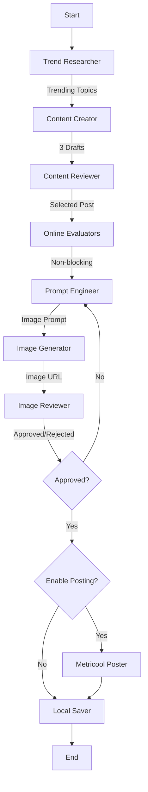

# Automated Social Media Post Workflow

An autonomous agentic workflow that researches trending tech topics, generates engaging social media content (text + images), reviews it for quality, and posts via Metricool (Twitter/X supported). Built with LangChain, LangGraph, and OpenAI/OpenRouter.

## Overview

This project automates the entire social media content pipeline:

1.  Research: Finds real-time trending topics in tech and work culture using Tavily or Brave Search.
2.  Drafting: Creates multiple fun, casual tweet options using `gpt-5`.
3.  Review: An AI editor selects the best draft based on engagement criteria.
4.  Online Evaluators: Non-blocking quality checks (groundedness, relevance, conciseness) with feedback to LangSmith.
5.  Visuals: Generates an accompanying image using `gpt-image-1-mini` (OpenAI or OpenRouter).
6.  Quality Control: A vision-enabled agent reviews the image for safety and relevance; up to 2 retries.
7.  Publishing: Posts via Metricool (Twitter/X) or saves locally if posting is disabled.

## Architecture

The system is orchestrated as a stateful graph using LangGraph:



### Components

-   `src/workflow.py`: Defines the LangGraph structure and conditional logic.
-   `src/config.py`: Central configuration for LLM initialization, caching, and API key validation. Supports OpenRouter/OpenAI.
-   `src/agents/`: Contains individual agent logic (Researcher, Creator, Reviewer, Prompt Engineer, Image Generator/Reviewer, Poster, Saver).
-   `src/state.py`: Defines the `AgentState` TypedDict used to pass data between nodes.
-   `src/evaluators/`: Online evaluators (groundedness, relevance, conciseness) + composite metrics and feedback to LangSmith.
-   `src/utils/metrics.py`: Node latency tracking and workflow metrics utilities.

## Prerequisites

-   Python 3.10+
-   API Keys:
    -   OpenAI or OpenRouter (LLMs, image generation, vision).
    -   Tavily or Brave Search (for research; if none, the Researcher falls back to static topics).
    -   Metricool (API token, User ID, Blog ID for posting to Twitter/X via Metricool).
    -   LangSmith (optional, for tracing and observability).

## Installation

### Option 1: Using VS Code Dev Container (Recommended)

If you have Docker and VS Code with the Dev Containers extension installed:

1.  Clone the repository:
    ```bash
    git clone <repository-url>
    cd automated-social-media-post-workflow
    ```

2.  Open in VS Code and reopen in container:
    - Open the folder in VS Code
    - When prompted, click "Reopen in Container"
    - Or press `F1` and run `Dev Containers: Reopen in Container`

The dev container will automatically set up Python 3.12, install all dependencies, and configure VS Code with recommended extensions. See [.devcontainer/README.md](.devcontainer/README.md) for more details.

### Option 2: Local Installation

1.  Clone the repository:
    ```bash
    git clone <repository-url>
    cd automated-social-media-post-workflow
    ```

2.  Install dependencies:
    ```bash
    pip install -r requirements.txt
    ```

## Configuration

Create a `.env` file in the root directory. You can use the template below:

```ini
# --- LLM Providers ---
# OpenRouter supported (model variety)
OPENROUTER_API_KEY=sk-or-...

# OpenAI API Key (LLMs and image generation)
OPENAI_API_KEY=sk-...

# --- Search Providers (Pick one) ---
TAVILY_API_KEY=tvly-...
# BRAVE_API_KEY=...

# --- Posting via Metricool ---
# If missing, the Poster agent will mock the post.
METRICOOL_API=...
METRICOOL_USER_ID=...
METRICOOL_BLOG_ID=...

# --- Azure Storage (Required for Image Uploads) ---
# Images are uploaded to Azure Blob Storage before posting to Metricool.
# If missing, posts will be created WITHOUT images.
AZURE_STORAGE_CONNECTION_STRING=DefaultEndpointsProtocol=https;AccountName=...;AccountKey=...;EndpointSuffix=core.windows.net
AZURE_STORAGE_CONTAINER_NAME=social-media-images

# --- Social Networks Configuration ---
# Comma-separated list of networks to post to: twitter, facebook, instagram, linkedin
# Default is "twitter" if not specified
SOCIAL_NETWORKS=twitter,facebook,instagram,linkedin

# --- Feature Flags ---
# If true, the workflow routes to Poster; if false, it routes directly to Saver.
ENABLE_POSTING=false

# --- LangSmith Tracing (Observability) ---
LANGCHAIN_TRACING_V2=true
LANGCHAIN_ENDPOINT="https://api.smith.langchain.com"
LANGCHAIN_API_KEY=lsv2-...
LANGCHAIN_PROJECT="social-media-agent"
```

### LangSmith Tracing & Evaluations

Enable tracing with `LANGCHAIN_TRACING_V2=true` and `LANGCHAIN_API_KEY`. The workflow logs per-node latencies and submits evaluator feedback (groundedness, relevance, conciseness) and a composite score to LangSmith.

- Models: Default chat models `gpt-5` and `gpt-5-mini`; image model `gpt-image-1-mini`; vision uses `gpt-5`.
- OpenRouter: Supported; provider base URL is set automatically. Model names are passed as-is.
- Verification: In LangSmith, you should see token usage, latency per node, evaluator feedback, and composite metrics.

## Usage

### Run the Workflow

Execute the main script to start the agent loop:

```bash
python main.py
```

The workflow will:
1.  Research a topic.
2.  Generate and review content.
3.  Run online evaluators (non-blocking quality checks).
4.  Generate an image; review and retry up to 2 times if rejected.
5.  Save the result to `social_media_posts/` (Markdown + local image in `social_media_posts/images/`).
6.  Post via Metricool (Twitter/X) if `ENABLE_POSTING=true`.

### Testing

- Run the saver node test to verify file writing and image handling:

```bash
python tests/test_saver.py
python tests/verify_saver.py
```

## Development

-   `main.py`: Entry point.
-   `src/`: Source code.
-   `tests/`: Test scripts.
-   `social_media_posts/`: Output directory for generated content.

## Troubleshooting

### Post Scheduled But No Image Appears
- **Cause**: Azure Storage credentials (`AZURE_STORAGE_CONNECTION_STRING` and `AZURE_STORAGE_CONTAINER_NAME`) are not configured.
- **Fix**: Set up an Azure Storage account and add the credentials to your `.env` file. Images must be uploaded to Azure Blob Storage before Metricool can use them.
- **Workaround**: Posts will still be created, but without images if Azure Storage is not configured.

### Post Only Goes to Twitter/X
- **Cause**: The `SOCIAL_NETWORKS` environment variable is not set or only includes Twitter.
- **Fix**: Set `SOCIAL_NETWORKS` in your `.env` file to include all desired networks:
  ```ini
  SOCIAL_NETWORKS=twitter,facebook,instagram,linkedin
  ```
- **Note**: Ensure your Metricool account is connected to all the social networks you want to post to.

### Evaluator Feedback Missing
- **Cause**: Tracing not enabled or `LANGCHAIN_API_KEY` missing.
- **Fix**: Enable `LANGCHAIN_TRACING_V2=true` and set `LANGCHAIN_API_KEY`.

### Image Generation Failed
- Cause: Missing `OPENAI_API_KEY`/`OPENROUTER_API_KEY` or provider model not available.
- Fix: Ensure API keys are set. For OpenRouter, `gpt-image-1-mini` may require `openai/`-prefixed model depending on provider availability.

### Metricool credentials missing
- Cause: `METRICOOL_API`, `METRICOOL_USER_ID`, or `METRICOOL_BLOG_ID` not set.
- Fix: Set these in `.env`. If missing, posting is mocked and content is still saved locally.
