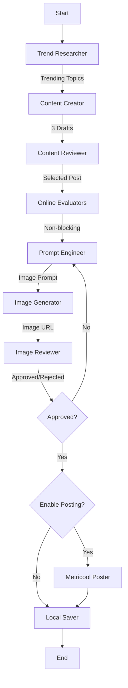

# Automated Social Media Post Workflow

An autonomous agentic workflow that researches trending tech topics, generates engaging social media content (text + images), reviews it for quality, and posts via Metricool to multiple social networks (Twitter/X, Facebook, Instagram, LinkedIn). Built with LangChain, LangGraph, and OpenAI/OpenRouter.

## Overview

This project automates the entire social media content pipeline:

1.  Research: Finds real-time trending topics in tech and work culture using Tavily or Brave Search.
2.  Drafting: Creates multiple fun, casual tweet options using `gpt-5`.
3.  Review: An AI editor selects the best draft based on engagement criteria.
4.  Online Evaluators: Non-blocking quality checks (groundedness, relevance, conciseness) with feedback to LangSmith.
5.  Visuals: Generates an accompanying image using `gpt-image-1-mini` (OpenAI or OpenRouter).
6.  Quality Control: A vision-enabled agent reviews the image for safety and relevance; up to 2 retries.
7.  Publishing: Posts via Metricool to configured social networks (Twitter/X, Facebook, Instagram, LinkedIn) or saves locally if posting is disabled.

## Architecture

The system is orchestrated as a stateful graph using LangGraph:



### Components

-   `src/workflow.py`: Defines the LangGraph structure and conditional logic.
-   `src/config.py`: Central configuration for LLM initialization, caching, and API key validation. Supports OpenRouter/OpenAI.
-   `src/agents/`: Contains individual agent logic (Researcher, Creator, Reviewer, Prompt Engineer, Image Generator/Reviewer, Poster, Saver).
-   `src/state.py`: Defines the `AgentState` TypedDict used to pass data between nodes.
-   `src/evaluators/`: Online evaluators (groundedness, relevance, conciseness) + composite metrics and feedback to LangSmith.
-   `src/utils/metrics.py`: Node latency tracking and workflow metrics utilities.

## Prerequisites

-   Python 3.10+
-   API Keys:
    -   **OpenAI or OpenRouter** (Required for LLMs, image generation, and vision).
    -   **Tavily or Brave Search** (Optional for research; if not provided, the Researcher uses static fallback topics).
    -   **Metricool** (Optional - API token, User ID, Blog ID for posting to social networks via Metricool).
    -   **Azure Storage** (Optional - Connection string and container name for image uploads to Metricool).
    -   **LangSmith** (Optional for tracing and observability).

## Installation

### Option 1: Using VS Code Dev Container (Recommended)

If you have Docker and VS Code with the Dev Containers extension installed:

1.  Clone the repository:
    ```bash
    git clone <repository-url>
    cd automated-social-media-post-workflow
    ```

2.  Open in VS Code and reopen in container:
    - Open the folder in VS Code
    - When prompted, click "Reopen in Container"
    - Or press `F1` and run `Dev Containers: Reopen in Container`

The dev container will automatically set up Python 3.12, install all dependencies, and configure VS Code with recommended extensions. See [.devcontainer/README.md](.devcontainer/README.md) for more details.

### Option 2: Local Installation

1.  Clone the repository:
    ```bash
    git clone <repository-url>
    cd automated-social-media-post-workflow
    ```

2.  Install dependencies:
    ```bash
    pip install -r requirements.txt
    ```

## Configuration

Create a `.env` file in the root directory with the following environment variables:

### Required Environment Variables

At minimum, you need one of these LLM providers:

```ini
# --- LLM Providers (Required - Choose one or both) ---
# OpenAI API Key (LLMs and image generation)
OPENAI_API_KEY=sk-...

# OR use OpenRouter (supports multiple model providers)
OPENROUTER_API_KEY=sk-or-...
```

### Optional Environment Variables

These variables enable additional features:

```ini
# --- Search Providers (Optional - Pick one) ---
# Used for researching trending topics. If not provided, uses static fallback topics.
TAVILY_API_KEY=tvly-...
# OR
BRAVE_API_KEY=...

# --- Posting via Metricool (Optional) ---
# If missing, the Poster agent will mock the post and save locally instead.
METRICOOL_API=your-metricool-api-token
METRICOOL_USER_ID=your-user-id
METRICOOL_BLOG_ID=your-blog-id

# --- Azure Storage (Required for Image Uploads with Metricool) ---
# Images must be uploaded to Azure Blob Storage before posting to Metricool.
# If missing, posts will be created WITHOUT images.
AZURE_STORAGE_CONNECTION_STRING=DefaultEndpointsProtocol=https;AccountName=...;AccountKey=...;EndpointSuffix=core.windows.net
AZURE_STORAGE_CONTAINER_NAME=social-media-images

# --- Social Networks Configuration (Optional) ---
# Comma-separated list of networks to post to: twitter, facebook, instagram, linkedin
# Default is "twitter" if not specified
SOCIAL_NETWORKS=twitter,facebook,instagram,linkedin

# --- Feature Flags (Optional) ---
# If true, the workflow routes to Poster; if false, it routes directly to Saver.
# Default is false
ENABLE_POSTING=false

# --- LangSmith Tracing (Optional - for Observability) ---
# Enable tracing and evaluation feedback in LangSmith
LANGCHAIN_TRACING_V2=true
LANGCHAIN_ENDPOINT=https://api.smith.langchain.com
LANGCHAIN_API_KEY=lsv2-...
LANGCHAIN_PROJECT=social-media-agent
```

### Complete Example `.env` File

```ini
# LLM Provider (required)
OPENAI_API_KEY=sk-...

# Search Provider (optional)
TAVILY_API_KEY=tvly-...

# Metricool (optional - for posting)
METRICOOL_API=your-metricool-api-token
METRICOOL_USER_ID=your-user-id
METRICOOL_BLOG_ID=your-blog-id

# Azure Storage (optional - for images)
AZURE_STORAGE_CONNECTION_STRING=DefaultEndpointsProtocol=https;AccountName=...;AccountKey=...;EndpointSuffix=core.windows.net
AZURE_STORAGE_CONTAINER_NAME=social-media-images

# Social Networks (optional)
SOCIAL_NETWORKS=twitter,facebook,instagram,linkedin

# Enable posting (optional, default is false)
ENABLE_POSTING=true

# LangSmith (optional - for observability)
LANGCHAIN_TRACING_V2=true
LANGCHAIN_API_KEY=lsv2-...
LANGCHAIN_PROJECT=social-media-agent
```

### Environment Variables Reference

| Variable | Required | Default | Description |
|----------|----------|---------|-------------|
| `OPENAI_API_KEY` | Yes* | None | OpenAI API key for LLMs, image generation, and vision |
| `OPENROUTER_API_KEY` | Yes* | None | OpenRouter API key (alternative to OpenAI) |
| `TAVILY_API_KEY` | No | None | Tavily API key for web search (research feature) |
| `BRAVE_API_KEY` | No | None | Brave Search API key (alternative to Tavily) |
| `METRICOOL_API` | No | None | Metricool API token for posting |
| `METRICOOL_USER_ID` | No | None | Metricool user ID |
| `METRICOOL_BLOG_ID` | No | None | Metricool blog/account ID |
| `AZURE_STORAGE_CONNECTION_STRING` | No | None | Azure Storage connection string for image uploads |
| `AZURE_STORAGE_CONTAINER_NAME` | No | None | Azure Storage container name for images |
| `SOCIAL_NETWORKS` | No | `twitter` | Comma-separated list of networks: twitter, facebook, instagram, linkedin |
| `ENABLE_POSTING` | No | `false` | Set to `true` to enable actual posting via Metricool |
| `LANGCHAIN_TRACING_V2` | No | `false` | Enable LangSmith tracing |
| `LANGCHAIN_API_KEY` | No | None | LangSmith API key |
| `LANGCHAIN_PROJECT` | No | None | LangSmith project name |
| `LANGCHAIN_ENDPOINT` | No | `https://api.smith.langchain.com` | LangSmith API endpoint |

\* At least one LLM provider (OpenAI or OpenRouter) is required.

### LangSmith Tracing & Evaluations

Enable tracing with `LANGCHAIN_TRACING_V2=true` and `LANGCHAIN_API_KEY`. The workflow logs per-node latencies and submits evaluator feedback (groundedness, relevance, conciseness) and a composite score to LangSmith.

- Models: Default chat models `gpt-5` and `gpt-5-mini`; image model `gpt-image-1-mini`; vision uses `gpt-5`.
- OpenRouter: Supported; provider base URL is set automatically. Model names are passed as-is.
- Verification: In LangSmith, you should see token usage, latency per node, evaluator feedback, and composite metrics.

## Usage

### Run the Workflow

Execute the main script to start the agent loop:

```bash
python main.py
```

The workflow will:
1.  Research a topic.
2.  Generate and review content.
3.  Run online evaluators (non-blocking quality checks).
4.  Generate an image; review and retry up to 2 times if rejected.
5.  Save the result to `social_media_posts/` (Markdown + local image in `social_media_posts/images/`).
6.  Post via Metricool to configured social networks if `ENABLE_POSTING=true`, otherwise save locally only.

### Testing

The repository includes several test files to verify different aspects of the workflow:

```bash
# Test the dev container setup
python tests/test_devcontainer.py

# Test the saver node (file writing and image handling)
python tests/test_saver.py
python tests/verify_saver.py

# Test multi-network posting configuration
python tests/test_multi_network.py

# Test social networks config parsing
python tests/test_social_networks_config.py

# Test the poster agent
python tests/test_poster.py

# Integration test for reported issues
python tests/test_integration_reported_issues.py
```

## Development

-   `main.py`: Entry point.
-   `src/`: Source code.
-   `tests/`: Test scripts.
-   `social_media_posts/`: Output directory for generated content.

## Troubleshooting

### Post Scheduled But No Image Appears
- **Cause**: Azure Storage credentials (`AZURE_STORAGE_CONNECTION_STRING` and `AZURE_STORAGE_CONTAINER_NAME`) are not configured.
- **Fix**: Set up an Azure Storage account and add the credentials to your `.env` file. Images must be uploaded to Azure Blob Storage before Metricool can use them.
- **Workaround**: Posts will still be created, but without images if Azure Storage is not configured.

### Post Only Goes to Twitter/X
- **Cause**: The `SOCIAL_NETWORKS` environment variable is not set or only includes Twitter.
- **Fix**: Set `SOCIAL_NETWORKS` in your `.env` file to include all desired networks:
  ```ini
  SOCIAL_NETWORKS=twitter,facebook,instagram,linkedin
  ```
- **Note**: Ensure your Metricool account is connected to all the social networks you want to post to.

### Evaluator Feedback Missing
- **Cause**: Tracing not enabled or `LANGCHAIN_API_KEY` missing.
- **Fix**: Enable `LANGCHAIN_TRACING_V2=true` and set `LANGCHAIN_API_KEY`.

### Image Generation Failed
- Cause: Missing `OPENAI_API_KEY`/`OPENROUTER_API_KEY` or provider model not available.
- Fix: Ensure API keys are set. For OpenRouter, `gpt-image-1-mini` may require `openai/`-prefixed model depending on provider availability.

### Metricool credentials missing
- Cause: `METRICOOL_API`, `METRICOOL_USER_ID`, or `METRICOOL_BLOG_ID` not set.
- Fix: Set these in `.env`. If missing, posting is mocked and content is still saved locally.
