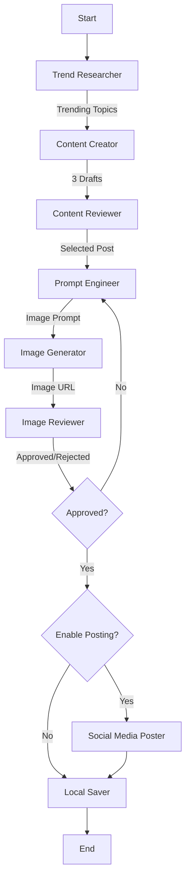

# Automated Social Media Post Workflow

An autonomous agentic workflow that researches trending tech topics, generates engaging social media content (text + images), reviews it for quality, and posts it to X (Twitter). Built with **LangChain**, **LangGraph**, and **OpenAI**.

## Overview

This project automates the entire social media content pipeline:

1.  **Research**: Finds real-time trending topics in tech and work culture using Tavily or Brave Search.
2.  **Drafting**: Creates multiple fun, casual tweet options using GPT-4o.
3.  **Review**: An AI editor selects the best draft based on engagement criteria.
4.  **Visuals**: Generates an accompanying image using DALL-E 3 (via OpenAI or OpenRouter).
5.  **Quality Control**: A vision-enabled agent (GPT-4o Vision) reviews the image for safety and relevance.
6.  **Publishing**: Posts the final content to X (Twitter) or saves it locally if posting is disabled.

## Architecture

The system is orchestrated as a stateful graph using **LangGraph**:



### Components

-   **src/workflow.py**: Defines the LangGraph structure and conditional logic.
-   **src/config.py**: Central configuration for LLM initialization and API key validation. Handles OpenRouter/OpenAI compatibility for LangSmith cost tracking.
-   **src/agents/**: Contains individual agent logic (Researcher, Creator, Reviewer, etc.).
-   **src/state.py**: Defines the `AgentState` TypedDict used to pass data between nodes.

## Prerequisites

-   **Python 3.10+**
-   **API Keys**:
    -   **OpenAI** (Required for Image Generation/Vision if not using OpenRouter for everything, though DALL-E 3 usually requires direct OpenAI key or specific OpenRouter support).
    -   **OpenRouter** (Optional, for accessing LLMs like GPT-4o).
    -   **Tavily** or **Brave Search** (For research).
    -   **X (Twitter)** (Consumer Key/Secret, Access Token/Secret with **Read & Write** permissions).
    -   **LangSmith** (Optional, for tracing and observability).

## Installation

1.  **Clone the repository**:
    ```bash
    git clone <repository-url>
    cd automated-social-media-post-workflow
    ```

2.  **Install dependencies**:
    ```bash
    pip install -r requirements.txt
    ```

## Configuration

Create a `.env` file in the root directory. You can use the template below:

```ini
# --- LLM Providers ---
# Primary LLM Provider (OpenRouter recommended for model variety)
OPENROUTER_API_KEY=sk-or-...

# OpenAI API Key (Required for DALL-E 3 image generation and Vision if not using OpenRouter)
OPENAI_API_KEY=sk-...

# --- Search Providers (Pick one) ---
TAVILY_API_KEY=tvly-...
# BRAVE_API_KEY=...

# --- Social Media (X/Twitter) ---
# Required for posting. If missing, the 'Poster' agent will mock the post.
X_CONSUMER_KEY=...
X_CONSUMER_SECRET=...
X_ACCESS_TOKEN=...
X_ACCESS_TOKEN_SECRET=...

# --- Feature Flags ---
# Set to "true" to actually post to X. Defaults to "false" (save only).
ENABLE_POSTING=false

# --- LangSmith Tracing (Observability) ---
LANGCHAIN_TRACING_V2=true
LANGCHAIN_ENDPOINT="https://api.smith.langchain.com"
LANGCHAIN_API_KEY=lsv2-...
LANGCHAIN_PROJECT="social-media-agent"
```

### LangSmith Tracing & Cost Tracking

To ensure accurate cost tracking in LangSmith, especially when using **OpenRouter**, the application is configured to handle model names carefully.

1.  **Enable Tracing**: Set `LANGCHAIN_TRACING_V2=true` and provide your `LANGCHAIN_API_KEY`.
2.  **Model Names**:
    -   The system uses `gpt-4o` and `gpt-4o-mini`.
    -   **OpenRouter Users**: The code in `src/config.py` automatically strips the `openai/` provider prefix when initializing the LangChain model. This ensures LangSmith recognizes the model name (e.g., `gpt-4o`) and applies the correct cost pricing from its registry.
    -   **Verification**: Check your LangSmith traces. You should see "Token Usage" populated and a calculated "Cost" field. If cost is $0, ensure the model name in the trace is exactly `gpt-4o` (not `openai/gpt-4o`).

## Usage

### Run the Workflow

Execute the main script to start the agent loop:

```bash
python main.py
```

The workflow will:
1.  Research a topic.
2.  Generate and review content.
3.  Generate an image.
4.  Save the result to `social_media_posts/` (Markdown + Image).
5.  Post to X if `ENABLE_POSTING=true`.

### Debugging X API

To verify your X (Twitter) credentials without running the full workflow:

```bash
python debug_x.py
```

## Development

### Project Structure

-   `main.py`: Entry point.
-   `src/`: Source code.
-   `tests/`: Test scripts.
-   `social_media_posts/`: Output directory for generated content.

### Testing

Run the saver node test to verify file writing permissions and logic:

```bash
python tests/test_saver.py
```

## Troubleshooting

### LangSmith Cost is $0
-   **Cause**: LangSmith does not recognize the model name (e.g., `openai/gpt-4o`).
-   **Fix**: Ensure you are using the latest version of `src/config.py` which removes the provider prefix. Alternatively, manually add `openai/gpt-4o` as a custom model in your LangSmith settings with the appropriate pricing.

### Image Generation Failed
-   **Cause**: Missing `OPENAI_API_KEY` or insufficient credits.
-   **Fix**: DALL-E 3 generation often requires a direct OpenAI key. Ensure `OPENAI_API_KEY` is set in `.env`.

### "X API keys missing"
-   **Cause**: Environment variables not loaded or named incorrectly.
-   **Fix**: Ensure you use `X_CONSUMER_KEY` and `X_CONSUMER_SECRET` (or `X_API_KEY`/`SECRET`) in `.env`. The `debug_x.py` script can help diagnose this.
