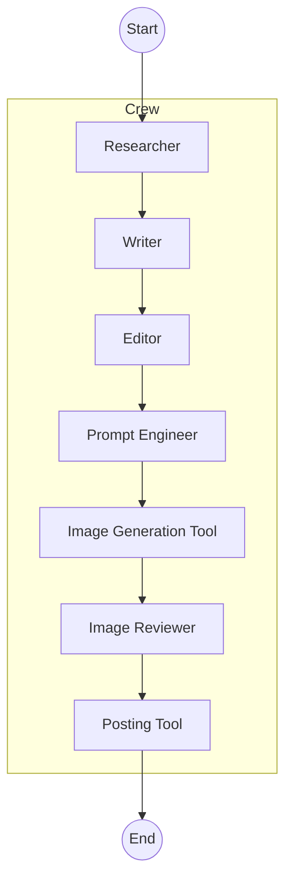

# Automated Social Media Post Workflow

## Overview
Automates researching trending topics, drafting multiple social media post options, selecting the best one, generating a supporting image, and posting to X (Twitter) using a sequential crew of AI agents (CrewAI + Gemini + Tweepy). Runs on a local schedule (Mon/Wed/Fri) and is designed for future cloud deployment.

## Key Features
- Multi-agent workflow (research, writing, editing, prompt engineering, image generation, review, posting).
- Image generation via Google Gemini Imagen model.
- Dual Tweepy API usage (v1.1 for media upload, v2 for tweet creation).
- Environment-driven configuration.
- Scheduled execution with graceful looping.
- Extensible tool and agent definitions.

## Tech Stack & Architecture
- Language: Python 3.11+ (recommended)
- Framework: CrewAI (agents, tasks orchestration)
- LLM Provider: Google Gemini (via OpenRouter-style key usage)
- Search: Brave Search Tool
- Social API: Tweepy (X API v1.1 + v2)
- Scheduling: `schedule` library
- Configuration: `.env` with `python-dotenv`
- Runtime Dependencies: See dependency section below.

### High-Level Flow
1. Research trending niche topics.
2. Draft 3 candidate posts.
3. Select the best post.
4. Engineer an image prompt (cartoon/comic style).
5. Generate & validate the image.
6. Post text + media to X.

### Mermaid Diagram


## Repository Structure
```
.
├── .gitignore
├── .env.example
├── requirements.txt
├── architecture_plan.md
├── list_models.py
└── src
    ├── agents.py
    ├── main.py
    ├── tasks.py
    └── tools.py
```

## File References
- [`architecture_plan.md`](architecture_plan.md)
- [`requirements.txt`](requirements.txt)
- [`src/main.py`](src/main.py)
- [`src/agents.py`](src/agents.py)
- [`src/tasks.py`](src/tasks.py)
- [`src/tools.py`](src/tools.py)
- [`list_models.py`](list_models.py)
- [`ImageGenTool._run()`](src/tools.py:15)
- [`XPostTool._run()`](src/tools.py:59)
- [`create_tasks()`](src/tasks.py:4)
- [`run_social_media_workflow()`](src/main.py:11)
- [`main()`](src/main.py:34)

## Environment Configuration
Copy `.env.example` to `.env` and fill:
```bash
GEMINI_API_KEY=your_gemini_key
BRAVE_API_KEY=your_brave_key
X_CONSUMER_KEY=your_x_consumer_key
X_CONSUMER_SECRET=your_x_consumer_secret
X_ACCESS_TOKEN=your_x_access_token
X_ACCESS_TOKEN_SECRET=your_x_access_token_secret
REQUIRE_APPROVAL=false   # Optional: if true requires human approval before posting
```

## Dependencies & Versions
Source: [`requirements.txt`](requirements.txt)

### Runtime
- crewai
- crewai-tools
- tweepy
- requests
- python-dotenv

(No explicit development/test dependencies declared.)

### Suggested Dev (Assumption)
- pytest
- black
- ruff
- mypy
- coverage

### Package Manager
- Pip (standard). Recommend: `pip >= 23`, Python `>=3.11`.

#### Install All (Bash)
```bash
python -m venv .venv
source .venv/bin/activate
pip install -r requirements.txt
```
#### Install All (PowerShell)
```powershell
python -m venv .venv
.\.venv\Scripts\Activate.ps1
pip install -r requirements.txt
```

## Installation & Setup
1. Clone repository.
2. Create virtual environment (see commands above).
3. Create `.env`.
4. Verify API keys.
5. Run workflow (see Usage).

## Local Development Workflow

| Action | Bash | PowerShell |
|--------|------|------------|
| Run main script | `python src/main.py` | `python src/main.py` |
| List models | `python list_models.py` | `python list_models.py` |
| Lint (assumed ruff) | `ruff check src` | `ruff check src` |
| Format (assumed black) | `black src` | `black src` |
| Type check (assumed mypy) | `mypy src` | `mypy src` |
| Test (assumed pytest) | `pytest -q` | `pytest -q` |
| Coverage (assumed) | `coverage run -m pytest && coverage report` | `coverage run -m pytest; coverage report` |
| Export requirements | `pip freeze > requirements.lock` | `pip freeze > requirements.lock` |

## Scripts & Automation Mapping
- [`src/main.py`](src/main.py): Entry point; schedules & runs workflow.
- [`list_models.py`](list_models.py): Diagnostic listing of available Gemini models.
- [`src/tools.py`](src/tools.py): Custom CrewAI tools (image generation + posting + search tool instances).
- Scheduling: Uses `schedule` library inside `main()` loop (Mon/Wed/Fri 10:00).

Integrated Terminal:
- Activate venv (`source .venv/bin/activate` or `.\.venv\Scripts\Activate.ps1`).
Output Pane:
- Run `python src/main.py` to see sequential agent logs (CrewAI verbose enabled).

tasks.json / launch.json:
- Not present. Suggest adding a launch config:
  ```json
  {
    "name": "Run Workflow",
    "type": "python",
    "request": "launch",
    "program": "src/main.py"
  }
  ```

## Testing Strategy
Current repository has no tests (assumption). Recommended layers:
- Unit: Test individual tool methods (`ImageGenTool._run`, `XPostTool._run`) with mocks.
- Integration: Full agent chain using stubbed API responses.
- End-to-End: Dry run with real keys (flag to disable posting in test mode).
Coverage Goal (assumed): ≥85%.

Run (assumed future):
```bash
pytest -q
```

## CI/CD (Assumptions)
- Pipeline: GitHub Actions (e.g., python setup → install → lint → test → coverage → build artifact).
- Triggers: push to main, PR open.
- Secrets: Stored in GitHub repository secrets (`GEMINI_API_KEY`, `BRAVE_API_KEY`, `X_*`).
- Caching: pip cache via `actions/cache`.
- Quality Gates: Ruff + pytest + coverage.
- Versioning: Semantic Versioning (tag releases).
- Releases: GitHub Releases with changelog.

## Branching Model (Assumed)
- main: Stable.
- feature/*: New capabilities.
- hotfix/*: Urgent fixes.

## Usage Examples

### Simple Run
```bash
python src/main.py
```

### Programmatic Invocation
```python
from src.main import run_social_media_workflow
run_social_media_workflow()
```

### Custom Topic
Modify inside [`run_social_media_workflow()`](src/main.py:11):
```python
topic_interest = "Quantum Computing Advances"
```

### Manual Post (By Tool)
```python
from src.tools import x_post_tool
print(x_post_tool._run(text="Hello world from CrewAI!"))
```

### Image Generation
```python
from src.tools import image_gen_tool
path = image_gen_tool._run("Cartoon robot celebrating a product launch, vibrant comic style")
print(path)
```

## Deployment

### Local (Current)
- Long-running Python process (while True + schedule).
- Use `tmux` or systemd (assumption) for persistence.

### Staging (Assumed)
- Containerize with minimal Python image.
- Add health endpoint (future enhancement).

### Production (Future Target)
- Azure Functions or container on Azure Container Apps.
- External scheduler (e.g., Azure Logic Apps or CronJob).

### Docker (Not Present, Assumption)
Example Dockerfile (to create):
```Dockerfile
FROM python:3.11-slim
WORKDIR /app
COPY requirements.txt .
RUN pip install --no-cache-dir -r requirements.txt
COPY . .
CMD ["python", "src/main.py"]
```

Build & Run:
```bash
docker build -t social-workflow .
docker run --env-file .env social-workflow
```

## Troubleshooting
| Issue | Cause | Fix |
|-------|-------|-----|
| Missing env warning | Empty `.env` values | Fill keys & restart |
| Tweet fails | Invalid or expired X tokens | Regenerate API keys |
| Image tool error | Gemini API response format change | Inspect raw response; update parser |
| Schedule not triggering | System clock/timezone mismatch | Verify server timezone |
| Unicode errors | Terminal locale | Set `export PYTHONUTF8=1` |

Enable Debug (Assumption):
- Add print/log statements or integrate `logging` module:
```python
import logging; logging.basicConfig(level=logging.DEBUG)
```

## Contributing
1. Fork repository.
2. Create feature branch (`git checkout -b feature/awesome`).
3. Add tests.
4. Ensure lint & format pass.
5. Open PR with clear description.

### Code Style
- Ruff + Black.
- 120 char max line length (assumption).
- Type hints encouraged.

### Code of Conduct (Assumption)
- Follow Contributor Covenant.

### Security Policy
- Report vulnerabilities via private issue / email (assumption security@yourdomain.example).
- Do not include secrets in commits.

### Support
- Issues tab for bugs.
- Discussions (if enabled) for ideas.
- Emergency: rotate keys and revoke compromised tokens.

## License
Assumed MIT. Add explicit `LICENSE` file.

## Change Log
Use GitHub Releases (assumption). Tag: `vMAJOR.MINOR.PATCH`.

## Future Enhancements (Roadmap)
- Add test suite.
- Add Docker + CI templates.
- Add rate limiting safeguards.
- Add multi-platform posting (LinkedIn, Instagram).
- Add human approval UI.

## Assumptions
- Python >=3.11 target.
- No tests yet; suggested tooling is advisory.
- MIT license presumed; not present.
- CI/CD inferred; not implemented.
- Docker/Kubernetes absent; sample provided as guidance.
- VS Code launch/tasks not present.
- Security disclosure email fictional.
- Gemini model endpoints may evolve; response parsing may require adjustment.
- Approval flow minimal (boolean env).

## Security Notes
- Do NOT commit real `.env`.
- Rotate keys periodically.
- Consider adding secret scanning pre-commit hook.

## Acknowledgments
- CrewAI community.
- Tweepy contributors.
- Google Gemini API.
- Brave Search API.
