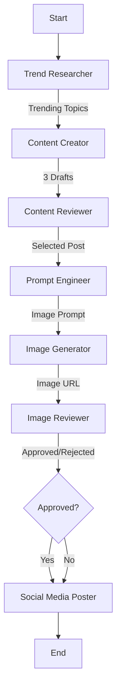

# Automated Social Media Post Workflow

An autonomous agentic workflow that researches trending tech topics, generates engaging social media content (text + images), reviews it for quality, and posts it to X (Twitter). Built with **LangChain**, **LangGraph**, and **OpenAI**.

## Overview

This project automates the entire social media content pipeline:

1.  **Research**: Finds real-time trending topics in tech and work culture.
2.  **Drafting**: Creates multiple fun, casual tweet options.
3.  **Review**: An AI editor selects the best draft.
4.  **Visuals**: Generates an accompanying image using AI art models.
5.  **Quality Control**: A vision-enabled agent reviews the image for safety and relevance.
6.  **Publishing**: Posts the final content to X.

## Workflow Architecture

The system is orchestrated as a stateful graph using **LangGraph**:



### Agents

- **Trend Researcher**: Uses **Brave Search** or **Tavily** to fetch live web data.
- **Content Creator**: Uses **GPT-4o** (via OpenRouter) to write engaging copy.
- **Content Reviewer**: Uses **GPT-4o** to critique and select the best post.
- **Prompt Engineer**: Uses **GPT-4o-mini** to craft DALL-E/GPT-Image prompts.
- **Image Generator**: Uses **GPT-Image-1-Mini** (or DALL-E 3) to create visuals.
- **Image Reviewer**: Uses **GPT-4o Vision** to validate image quality.
- **Poster**: Uses **Tweepy** to interface with the X API.

## Setup & Installation

### Prerequisites

- Python 3.10+
- API Keys for:
  - **OpenAI** (for Image Generation/Vision)
  - **OpenRouter** (for LLMs)
  - **Brave Search** or **Tavily** (for Research)
  - **X (Twitter)** (Consumer Key/Secret, Access Token/Secret with **Read & Write** permissions)

### Installation

1.  **Clone the repository**:

    ```bash
    git clone <repository-url>
    cd automated-social-media-post-workflow
    ```

2.  **Install dependencies**:

    ```bash
    pip install -r requirements.txt
    ```

3.  **Configure Environment**:
    Create a `.env` file in the root directory and add your keys:

    ```ini
    # LLM Providers
    OPENROUTER_API_KEY=sk-or-...
    OPENAI_API_KEY=sk-...  # Required for Image Generation

    # Search Providers
    BRAVE_API_KEY=...      # Or TAVILY_API_KEY=...

    # X (Twitter) API
    X_CONSUMER_KEY=...
    X_CONSUMER_SECRET=...
    X_ACCESS_TOKEN=...
    X_ACCESS_TOKEN_SECRET=...
    ```

    > **Note**: For `gpt-image-1-mini`, ensure your OpenAI Organization is **verified** in your platform settings.

## Usage

Run the workflow manually:

```bash
python main.py
```

The script will output the progress of each agent to the console. Upon success, it will print the ID of the posted tweet.

## Customization

- **Topic**: Modify the search query in `src/agents/researcher.py`.
- **Tone**: Adjust the system prompt in `src/agents/content_creator.py`.
- **Image Style**: Edit the prompt instructions in `src/agents/prompt_engineer.py`.
