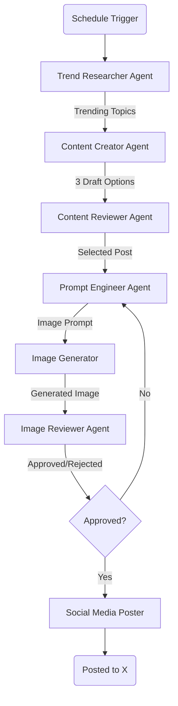

# Architecture Plan: Automated Social Media Post Workflow

## Overview

This document outlines the architecture for an automated social media posting system. The system employs a team of AI agents orchestrated by LangChain (specifically LangGraph) to research, write, review, generate images, and post content to X (formerly Twitter) on a schedule (2-3 times/week).

## Workflow Architecture

## Agent Roles & Model Selection

We aim for a balance of high quality and cost-effectiveness. Given the low volume (2-3 posts/week), we can afford higher-quality models for critical steps without incurring significant costs.

| Agent Role           | Responsibility                                                  | Recommended Model                     | Reasoning                                                                    |
| :------------------- | :-------------------------------------------------------------- | :------------------------------------ | :--------------------------------------------------------------------------- |
| **Trend Researcher** | Search web for trending topics in **Tech & Work Culture**.      | **GPT-4o-mini** or **Claude 3 Haiku** | Fast, cheap, and capable of summarizing search results (via Tavily/Serper).  |
| **Content Creator**  | Draft 3 distinct post options. **Tone: Casual, Fun, Engaging.** | **GPT-4o** or **Claude 3.5 Sonnet**   | Requires high creativity and nuance to match the "fun tech" persona.         |
| **Content Reviewer** | Evaluate drafts and select the best one.                        | **GPT-4o**                            | Strong reasoning required to judge quality and alignment.                    |
| **Prompt Engineer**  | Create detailed image generation prompts.                       | **GPT-4o-mini**                       | Instruction following is key; smaller models handle this well.               |
| **Image Generator**  | Generate the visual asset.                                      | **DALL-E 3**                          | Simple API integration, high adherence to prompts. (~$0.04/img)              |
| **Image Reviewer**   | Verify image against guidelines and prompt.                     | **GPT-4o** (Vision)                   | Multimodal capabilities required to "see" the image.                         |
| **Poster**           | Interface with Social APIs.                                     | **N/A** (Python Script)               | **Phase 1**: X API (Free Tier). **Phase 2**: Metricool API (Multi-platform). |

## Tech Stack

- **Orchestration**: [LangChain](https://www.langchain.com/) + [LangGraph](https://langchain-ai.github.io/langgraph/) (for stateful, cyclic multi-agent flows).
- **Runtime (Dev)**: Local Python environment.
- **Runtime (Prod)**: Azure Functions (Serverless, cost-effective for scheduled tasks).
- **State Management**: LangGraph Checkpointing (can use simple in-memory for dev, Azure Table Storage/Cosmos DB or Postgres for prod persistence if needed).
- **Tools**:
  - **Search**: Tavily API or Serper (Google Search).
  - **Social**:
    - _Dev/Test_: Tweepy (X API).
    - _Prod/Future_: Metricool API (Wrapper).

## Cost Analysis (Estimated)

_Assumption: 3 runs per week, ~4 weeks/month = 12 runs/month._

- **LLM Costs**: < $5.00 / month (Volume is very low).
- **Image Gen**: 12 images \* $0.04 = $0.48 / month.
- **Search API**: Tavily (Free tier might suffice, or ~$20/mo if higher volume needed).
- **Azure Functions**: Likely within free grant or pennies per month for this execution time.

**Total Estimated Operational Cost**: < $10 - $30 / month (depending on Search API tier).

## Questions for User

1.  **Niche/Topic**: What is the specific industry or topic the agents should research?
2.  **Brand Voice**: Do you have existing brand guidelines or examples of "good" posts?
3.  **X API Access**: Do you already have an X (Twitter) Developer account? (Free tier has write-only access which might be enough, but Basic tier ($100/mo) is usually needed for API posting reliability).
4.  **Azure Resources**: Do you have an existing Azure subscription we should target?
