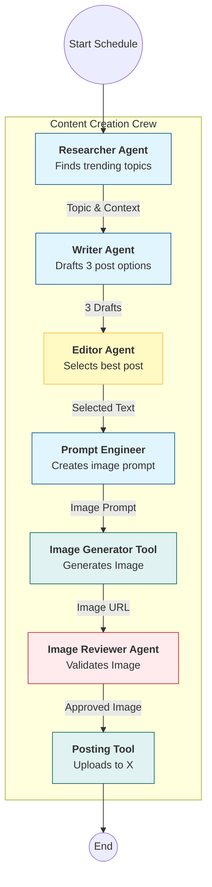

# Automated Social Media Post Workflow Architecture

## Overview

This project aims to automate the creation and posting of social media content to X (formerly Twitter). The system utilizes a team of AI agents orchestrated by **CrewAI** to research trending topics, draft content, generate accompanying images, review assets for quality and safety, and finally publish the post.

## System Architecture



## Tech Stack

- **Framework:** [CrewAI](https://crewai.com) (Python)
- **LLM Provider:** Google Gemini
- **Search Tool:** Brave Search
- **Social Media API:** Tweepy (X/Twitter API v2)
- **Hosting:** Local Machine (Phase 1), Azure Functions (Phase 2)

## Agents & Models

| Agent                | Role                                                                                   | Model                               | Tools             |
| -------------------- | -------------------------------------------------------------------------------------- | ----------------------------------- | ----------------- |
| **Trend Researcher** | Scours the web for trending news and topics relevant to the company's niche.           | `gemini-1.5-pro`                    | `BraveSearchTool` |
| **Content Writer**   | Creates engaging, viral-worthy social media copy. Produces 3 distinct variations.      | `gemini-1.5-pro`                    | None              |
| **Chief Editor**     | Reviews drafts for tone, clarity, and brand alignment. Selects the single best option. | `gemini-1.5-flash`                  | None              |
| **Visual Director**  | Crafts detailed image generation prompts based on the selected text.                   | `gemini-1.5-flash`                  | None              |
| **Image Reviewer**   | Analyzes generated images to ensure they match the prompt and safety guidelines.       | `gemini-1.5-flash` (Vision Capable) | `VisionTool`      |

## Custom Tools

### 1. Image Generation Tool

- **Provider:** Google Gemini (Imagen 3)
- **Model:** `imagen-3.0-generate-001`
- **Input:** Text prompt
- **Output:** Local file path (saved locally for upload)

### 2. X Posting Tool

- **Library:** `tweepy`
- **Input:** Text content, Image path
- **Action:** Uploads media, posts tweet
- **Output:** Success/Failure status + Tweet URL

## Data Flow & Tasks

1.  **Research Task:**
    - _Input:_ Niche/Industry keywords.
    - _Output:_ A summary of top 3 trending topics with links.
2.  **Drafting Task:**
    - _Input:_ Research summary.
    - _Output:_ 3 distinct post options (Hook + Body + Hashtags).
3.  **Selection Task:**
    - _Input:_ 3 Draft options.
    - _Output:_ The single best post text.
4.  **Image Prompting Task:**
    - _Input:_ Selected post text.
    - _Output:_ A detailed descriptive prompt for the image generator.
5.  **Generation & Review Task:**
    - _Action:_ Call Image Gen Tool -> Get Image -> Reviewer checks image.
    - _Logic:_ If rejected, regenerate (optional loop). If approved, pass to poster.
6.  **Posting Task:**
    - _Action:_ Authenticate with X API -> Upload Image -> Post Text.

## Configuration (.env)

```bash
GEMINI_API_KEY=...
BRAVE_API_KEY=...
X_CONSUMER_KEY=...
X_CONSUMER_SECRET=...
X_ACCESS_TOKEN=...
X_ACCESS_TOKEN_SECRET=...
```

## Scheduling (Local)

For the local phase, we will use a simple Python script with the `schedule` library or a system cron job to run the main script on the desired days (e.g., Mon, Wed, Fri).
